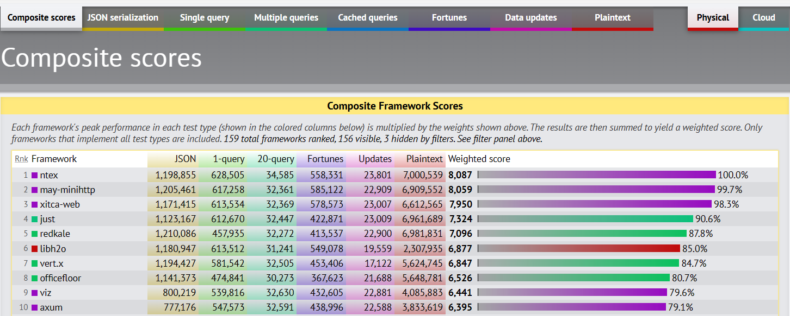

# uHTTP Server

This is a simple HTTP server written in Python 3. It is intended to explain how HTTP works and how to implement a simple HTTP server.

## HTTP is just a text protocol

HTTP is a text protocol. It means that all the data that is sent and received is text. It is not binary. It is not encrypted. It is not compressed. It is just text.

We can test HTTP using the `telnet` command. For example, we can connect to the Google server and send a request:

```bash
$ telnet httpbin.org 80
Trying <IP>...
Connected to www.google.com.
Escape character is '^]'.

# Send a request
GET / HTTP/1.0

# Send an empty line
```

The server will respond with a response:

```http
HTTP/1.1 200 OK
Date: Sat, 18 Nov 2023 14:42:24 GMT
Content-Type: text/html; charset=utf-8
Content-Length: 9593
Connection: close
Server: gunicorn/19.9.0
Access-Control-Allow-Origin: *
Access-Control-Allow-Credentials: true

<!DOCTYPE html>
<html lang="en">

<head>
    ...
</head>
<body>
    ...
</body>
</html>
```

For a POST request, we can send data to the server:

```bash
$ telnet httpbin.org 80
Trying 54.161.176.214...
Connected to httpbin.org.
Escape character is '^]'.

# Send a request
POST /post HTTP/1.0
Content-Type: application/x-www-form-urlencoded
Content-Length: 21

name=John&surname=Doe

# Response
HTTP/1.1 200 OK
Date: Sat, 18 Nov 2023 14:45:20 GMT
Content-Type: application/json
Content-Length: 513
Connection: close
Server: gunicorn/19.9.0
Access-Control-Allow-Origin: *
Access-Control-Allow-Credentials: true

{
  "args": {},
  "data": "",
  "files": {},
  "form": {
    "name": "John",
    "surname": "Doe"
  },
  "headers": {
    "Content-Length": "21",
    "Content-Type": "application/x-www-form-urlencoded",
    "Host": "k8s-pmhttpbi-pmhttpbi-4b5623588d-1738525105.us-east-1.elb.amazonaws.com",
    "X-Amzn-Trace-Id": "Root=1-6558cdf3-484483a731ae160b74934326"
  },
  "json": null,
  "origin": "93.44.80.155",
  "url": "http://k8s-pmhttpbi-pmhttpbi-4b5623588d-1738525105.us-east-1.elb.amazonaws.com/post"
}
```

## Python uHTTP Server

### Step 1: Simple Response

The example can be found in the `python/1simple_response.py` file. The server is very simple. It listens on port 8088 and returns a simple response in text format. We can run the server using the following command:

```bash
# Run the server from the root directory
$ python3 python/1simple_response.py

```

## How fast are Web Frameworks?

This is a simple image reporting some of the most performant web frameworks.



- Purple is Rust (a compiled language with performance comparable to C)
- Red is C
- Green is Java
- `just` in Green is the only interpreted language (JavaScript)

## What about the Client Side?

- https://browser.engineering/index.html

## Common Issues

If you get that is impossible to bind the socket to the address, it means that the port is already in use. You can check which process is using the port using the following command:

```bash
$ sudo lsof -i :8088
COMMAND     PID      USER   FD   TYPE DEVICE SIZE/OFF NODE NAME
uhttp_pag 19411 agarbugli    3u  IPv4 371081      0t0  TCP *:omniorb (LISTEN)
```

You can kill the process using the following command:

```bash
$ sudo kill -9 1234
# or
$ sudo killall <process_name>
```

If you are sure that the process is not running, but still you get the error, you can to force the closing of the socket using the following command:

```bash
$ fuser -k 8088/tcp
```

## References

[1] Van Winkle, Lewis. Hands-On Network Programming with C: Learn socket programming in C and write secure and optimized network code. Packt Publishing Ltd, 2019.

[2] https://www.rfc-editor.org/rfc/rfc9112

[3] https://www.rfc-editor.org/rfc/rfc9113
